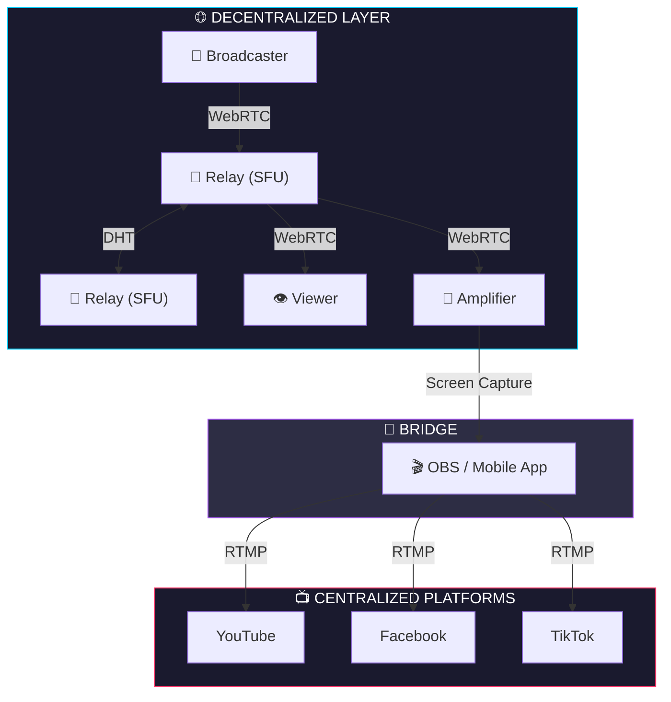

# oneye

Decentralized P2P live streaming with distributed amplification.

**Zero accounts. Zero CDN. Zero tracking. One HTML file.**

**[Try it now](https://msitarzewski.github.io/oneye/)** - no install needed, connects to the public relay automatically.

Broadcast live video to anyone. Viewers can "amplify" your stream by restreaming to YouTube, Facebook, TikTok - creating a distributed amplification network.

## Quick Start

### Run a Relay

```bash
npm install
node server.js
```

The relay starts on port 3000 by default and shows all available network interfaces:

```
[oneye] Relay listening on http://0.0.0.0:3000
[oneye] LAN: http://192.168.1.144:3000
```

**Configuration** (copy `config.json.example` to `config.json`):

```json
{
  "port": 3000,
  "host": "127.0.0.1",
  "publicUrl": "wss://relay.yourdomain.com",
  "allowedOrigins": null,
  "maxConnections": 500
}
```

Environment variables override `config.json`: `PORT`, `HOST`, `PUBLIC_URL`, `ALLOWED_ORIGINS`, `MAX_WS_CONNECTIONS`.

**TURN server** (optional, for NAT traversal): `TURN_URL`, `TURN_USERNAME`, `TURN_CREDENTIAL` — or set `turnUrl`, `turnUsername`, `turnCredential` in `config.json`. See [TURN Server](#turn-server-optional) below.

### Go Live

1. Open the relay URL in your browser (e.g., `http://192.168.1.144:3000`)
2. Click **Go Live**
3. Grant camera/microphone access
4. Share the URL shown at the bottom of your preview

### Watch a Stream

1. Open the shared URL, or navigate to any relay in the network
2. Click on a stream card to watch
3. Audio plays automatically; video appears in the overlay

## Architecture



**Key components:**
- **Relay/SFU**: Receives streams from broadcasters, forwards to viewers. Relays discover each other via DHT (Hyperswarm).
- **Broadcaster**: Captures camera/mic, sends to relay via WebRTC.
- **Viewer**: Receives stream from relay (or via mesh from other viewers).
- **Amplifier**: A viewer who restreams to centralized platforms using OBS or mobile apps. Broadcaster stays decentralized; amplifiers bridge to YouTube/Facebook/TikTok independently.

## Features

### Self-Discovering Network
Deploy a relay anywhere. It automatically joins the global network via DHT. No configuration needed.

### Cross-Relay Streaming
Streams announced on Relay A are visible on Relay B. Viewers can watch streams from any relay in the network.

### Mesh Forwarding
High-bandwidth viewers can optionally forward streams to other viewers, reducing relay load. Auto-enabled on WiFi with good battery.

### Bandwidth Adaptation
Broadcasters encode in multiple quality layers (simulcast). Viewers receive the layer matching their bandwidth.

### Distributed Amplification
Supporters can independently restream to YouTube, Facebook, TikTok, and Instagram. The broadcaster stays on oneye (decentralized, ephemeral) while amplifiers spread the message through centralized platforms. Multiple amplifiers = wider reach.

### Map View
See streams on an interactive map. Broadcasters can optionally share their location with configurable precision (exact, neighborhood, city, or region). Theme-aware map tiles adapt to light/dark mode.

### Settings & Preferences
User preferences persist in localStorage:
- **Theme**: System, Dark, or Light mode with full light theme support
- **Auto-play**: Control whether streams play automatically
- **Location**: Remember location permission and default precision
- **Notifications**: Browser notifications for new streams
- **Default View**: Start with Live Streams, Archives, or Map

### Mobile-First Design
- **Hamburger menu**: Full navigation on mobile with Live/Archives/Map tabs
- **Categories grid**: Browse categories in a 2-column layout
- **Touch-friendly**: Tap-to-toggle tooltips and responsive controls
- **Adaptive UI**: Sidebar collapses to icons, expands on interaction

### Broadcast Setup
Before going live, configure your stream:
- Set a title
- Choose categories and add custom tags
- Enable/disable location sharing
- Select location precision level
- Enable server-side recording (optional)

### Privacy by Design
- **Ephemeral**: Streams exist only while live. Nothing is recorded.
- **No accounts**: Your identity is a keypair stored in your browser.
- **No tracking**: No analytics, no cookies, no persistent data on relays.
- **Location control**: Choose exact, neighborhood, city, or region-level precision.

## Amplify a Stream

Help spread the message by restreaming to YouTube, Facebook, TikTok, or Instagram.

### Desktop (OBS Studio)

1. Watch a stream on oneye
2. Click **Pop Out** to open a clean capture window
3. In OBS, add a **Window Capture** source
4. Select the oneye pop-out window
5. Add your RTMP destination (YouTube/Twitch/etc)
6. Click **Start Streaming**

### Mobile (iOS/Android)

**Prism Live Studio** (Free, multi-platform):
1. Install from App Store / Play Store
2. Enable screen recording
3. Open oneye in browser, start watching
4. In Prism, go live to your platforms

**Streamlabs** (Alternative):
1. Install Streamlabs mobile app
2. Set up your streaming accounts
3. Use screen broadcast feature
4. Open oneye and watch the stream

### Amplify Mode Features

- **Pop Out**: Opens a clean, borderless window optimized for OBS capture
- **Picture-in-Picture**: Floats video over other windows
- **Fullscreen**: Native fullscreen for full display capture
- **Quality Selector**: Choose 720p/360p/180p based on your bandwidth
- **Stream Info**: Press **I** in amplify mode to toggle stream title overlay

### Tips for Amplifiers

- Use **720p** quality for best restream quality
- Close other apps to reduce CPU usage
- Use wired connection if possible (ethernet > WiFi > cellular)
- Multiple amplifiers = wider reach. Coordinate!

### Recommended Apps

**Desktop:**
- OBS Studio (Free, open source) - Best for window capture
- Streamlabs Desktop (Free) - Simpler UI than OBS

**Mobile:**
- Prism Live Studio (Free) - Multi-platform restreaming
- Streamlabs Mobile (Free) - Easy setup
- Restream (Freemium) - Web-based, multistreams

## Network Discovery

Clients find relays through multiple methods (in priority order):

1. **URL hash**: `https://example.com/#relay=wss://relay.example.com`
2. **Bootstrap**: Fetches relay list from GitHub Pages ([`relays.json`](docs/relays.json)) - update this file when relays change
3. **Well-known**: `/.well-known/oneye.json` on the current domain
4. **DNS TXT**: `_oneye.example.com` TXT records via DNS-over-HTTPS
5. **Self**: The URL you loaded becomes the relay

## Deploy Your Own Relay

### Local/LAN

```bash
git clone <repo>
cd oneye
npm install
node server.js
```

Share your LAN IP with others on the same network.

### Public (with ngrok)

```bash
node server.js &
ngrok http 3000
```

Share the ngrok HTTPS URL. WebSocket connections use WSS automatically.

### Production

```bash
cp config.json.example config.json
# Edit config.json with your domain and settings, then:
node server.js
```

Put behind nginx/caddy for TLS termination. Set `publicUrl` in `config.json` so the relay announces its public address to the DHT.

### TURN Server (Optional)

WebRTC requires direct UDP connections between peers. ~15-20% of users are behind symmetric NAT or restrictive firewalls where STUN alone isn't enough. Adding a TURN server provides a relay fallback for these users.

Without TURN, affected users will see stream thumbnails but video won't play.

**Self-hosted with coturn:**

```bash
# Install coturn
sudo apt install coturn   # Debian/Ubuntu
brew install coturn        # macOS

# /etc/turnserver.conf
listening-port=3478
min-port=49152
max-port=50175
realm=relay.example.com
user=oneye:your-secret-here
lt-cred-mech
fingerprint
```

Open firewall ports: UDP/TCP 3478 + UDP 49152-50175. TURN traffic goes direct to coturn, not through your reverse proxy.

```bash
TURN_URL=turn:relay.example.com:3478 \
TURN_USERNAME=oneye \
TURN_CREDENTIAL=your-secret-here \
PUBLIC_URL=wss://relay.example.com \
node server.js
```

The relay sends its ICE config (including TURN) to clients on connect. Each relay in the network can run its own TURN server independently.

**Other TURN providers:** Cloudflare Calls TURN (free), metered.ca (free tier), Twilio (paid). Set the env vars to match your provider's credentials.

## API

### WebSocket Messages

**Client → Relay:**
- `subscribe` - Join the network, receive stream list
- `announce` - Start broadcasting a stream
- `unannounce` - Stop broadcasting
- `view` - Request to watch a stream
- `signal_forward` - WebRTC SDP offer (broadcaster)
- `answer` - WebRTC SDP answer (viewer)
- `candidate` - ICE candidate
- `layer_request` - Request specific quality layer (h/m/l) for simulcast
- `bandwidth_report` - Report estimated bandwidth for adaptive streaming

**Relay → Client:**
- `ice_servers` - ICE configuration (STUN + TURN if configured), sent on connect
- `welcome` / `subscribed` - Connection confirmed, includes stream and relay lists
- `stream_available` - New stream announced
- `stream_gone` - Stream ended
- `signal` - WebRTC SDP (offer to viewer, answer to broadcaster)
- `candidate` - ICE candidate

### HTTP Endpoints

- `GET /` - Serve the app
- `GET /health` - JSON status: `{ ok, streams, clients, relays }`
- `GET /relays` - List of known relays
- `GET /.well-known/oneye.json` - Relay discovery endpoint

## Philosophy

- **Ephemeral**: Nothing persists. When a stream ends, it's gone.
- **Decentralized**: No central authority. Anyone can run a relay.
- **Simple**: One HTML file, one JS file. No build step for the client.
- **Private**: No accounts, no tracking, no data collection.

## License

MIT - See [LICENSE](LICENSE)

### Bundled Libraries

All dependencies are inlined - no external CDN requests:

- **QRCode.js** - MIT License - [github.com/davidshimjs/qrcodejs](https://github.com/davidshimjs/qrcodejs)
- **werift-webrtc** - MIT License - [github.com/shinyoshiaki/werift-webrtc](https://github.com/shinyoshiaki/werift-webrtc)
