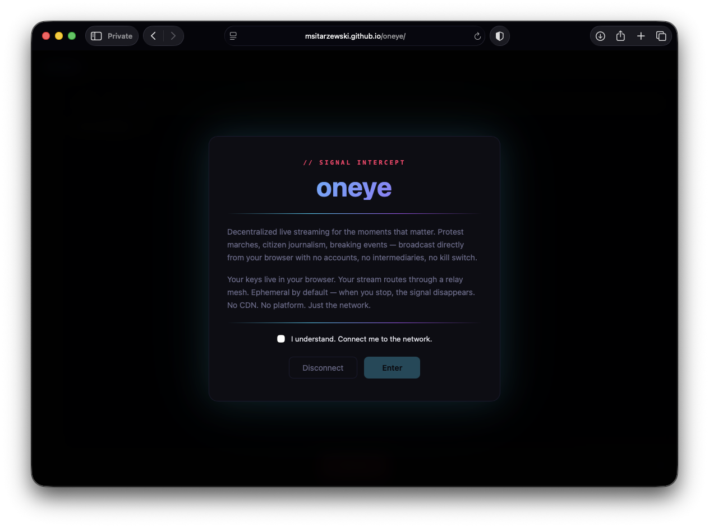
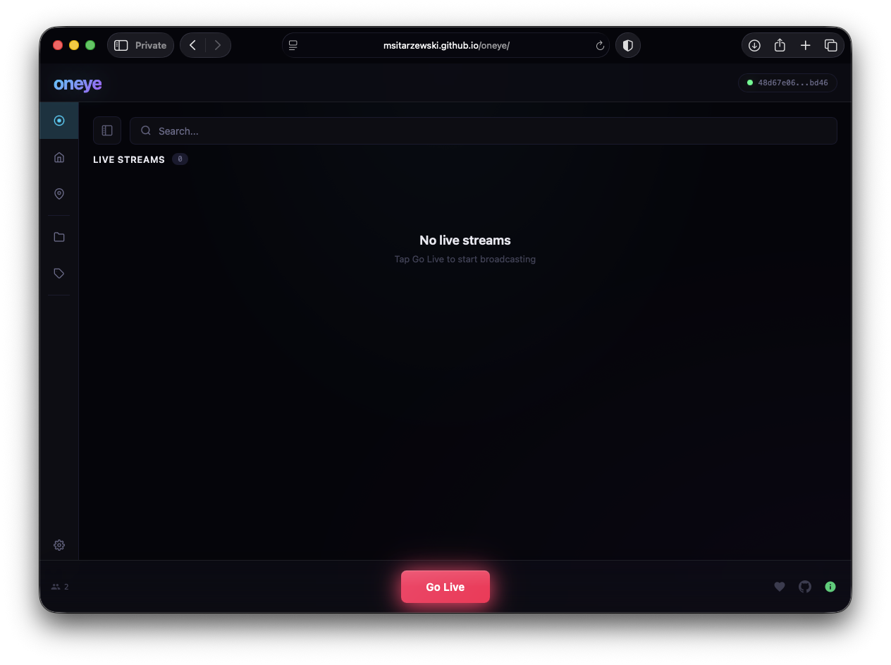
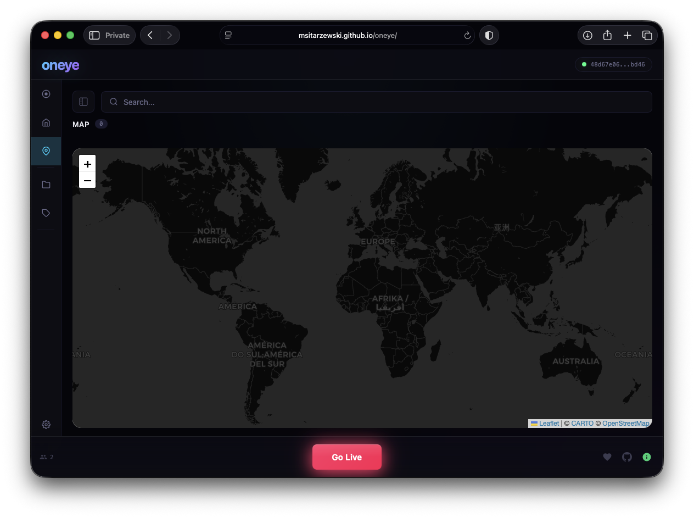
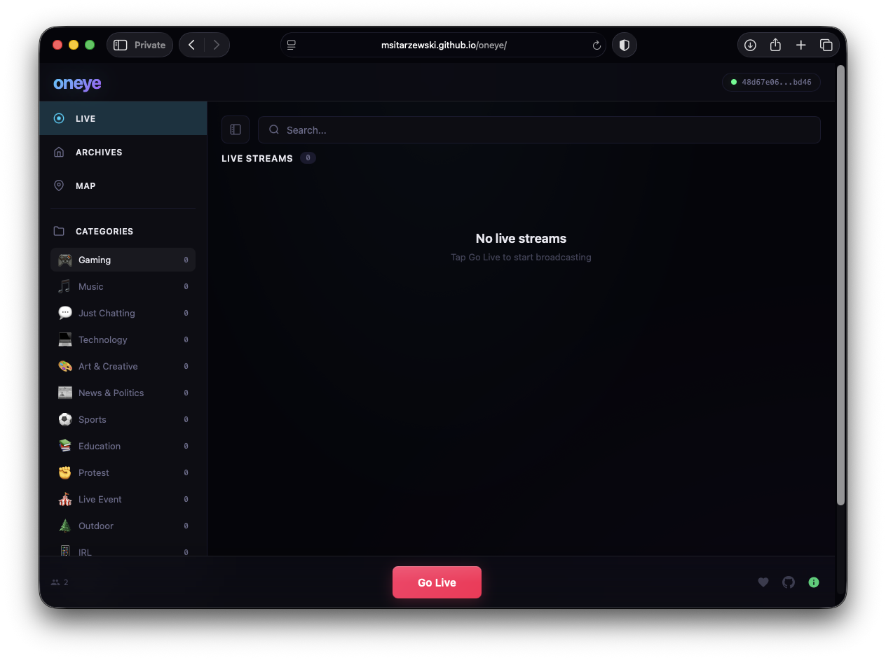
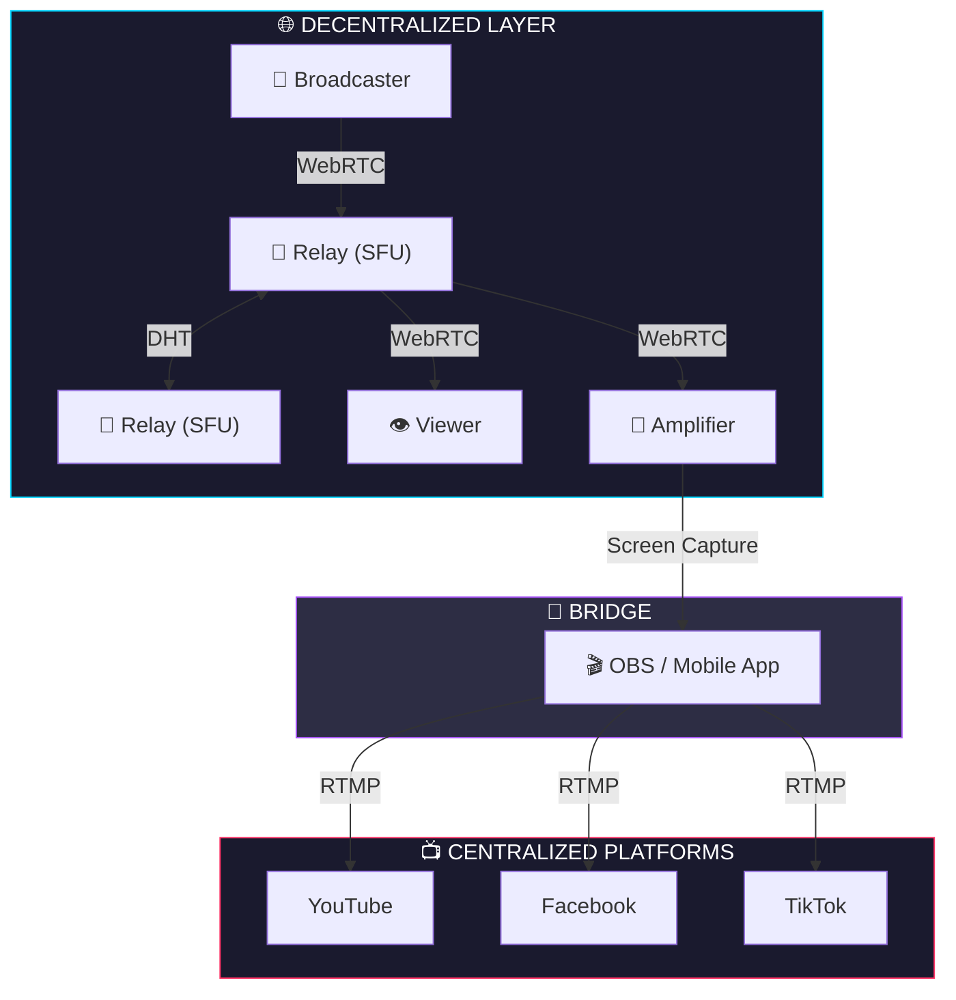

<div align="center">

# `oneye`

### Uncensorable live streaming. Zero infrastructure. Zero identity. Zero compromise.

[](https://nodejs.org)
[](LICENSE)
[]()
[](https://github.com/msitarzewski/oneye/pulls)

**[Live Demo](https://msitarzewski.github.io/oneye/)** | **[GitHub](https://github.com/msitarzewski/oneye)** | **[Sponsor](https://github.com/sponsors/msitarzewski)**

</div>

---

## The Mission

Somewhere right now, someone is pointing a phone at something the world needs to see. A protest. A disaster. An act of power that was never meant to be witnessed. The stream goes up, the platform takes it down. Account suspended. Evidence gone.

oneye exists because live video should not require permission. No sign-up forms. No terms of service. No content moderation team in a corporate office deciding what counts as news. You open a browser, you go live. Your identity is a cryptographic keypair that lives and dies in your browser tab. The relay you connect to is one node in a self-organizing mesh -- kill one, the others keep running.

One HTML file. That's the entire client. No build step, no dependency tree, no app store approval. Serve it from a USB stick, a Raspberry Pi, a borrowed VPS, or open it directly from GitHub Pages. The relay is a single Node.js process. Clone. Install. Run. You're broadcasting.

Viewers don't just watch -- they amplify. Any viewer can restream to YouTube, Facebook, TikTok through OBS or a mobile app. The broadcaster stays anonymous on the decentralized network while amplifiers push the signal into every centralized platform simultaneously. One stream becomes ten. The message gets out.

<div align="center">
<table>
<tr>
<td></td>
<td></td>
</tr>
<tr>
<td align="center"><em>Splash screen</em></td>
<td align="center"><em>Live streams</em></td>
</tr>
<tr>
<td></td>
<td></td>
</tr>
<tr>
<td align="center"><em>Map view</em></td>
<td align="center"><em>Sidebar with categories</em></td>
</tr>
</table>
</div>

## Quick Start

### Run a Relay

```bash
npm install
node server.js
```

The relay binds to port 3000 and prints every available network interface:

```
[oneye] Relay listening on http://0.0.0.0:3000
[oneye] LAN: http://192.168.1.144:3000
```

**Configuration** -- copy `config.json.example` to `config.json`:

```json
{
  "port": 3000,
  "host": "127.0.0.1",
  "publicUrl": "wss://relay.yourdomain.com",
  "allowedOrigins": null,
  "maxConnections": 500
}
```

Environment variables override `config.json`: `PORT`, `HOST`, `PUBLIC_URL`, `ALLOWED_ORIGINS`, `MAX_WS_CONNECTIONS`.

**TURN server** (optional, for NAT traversal): `TURN_URL`, `TURN_USERNAME`, `TURN_CREDENTIAL` -- or set `turnUrl`, `turnUsername`, `turnCredential` in `config.json`. See [TURN Server](#turn-server-optional) below.

### Go Live

1. Open the relay URL in your browser (e.g., `http://192.168.1.144:3000`)
2. Click **Go Live**
3. Grant camera/microphone access
4. Share the URL shown at the bottom of your preview

### Watch a Stream

1. Open the shared URL, or navigate to any relay in the network
2. Click on a stream card to watch
3. Audio plays automatically; video appears in the overlay

## Architecture



The system has three layers:

- **Relay (SFU)** -- Receives streams from broadcasters and forwards them to viewers. Relays discover each other automatically via DHT (Hyperswarm). No registry. No coordinator. They find each other.
- **Broadcaster** -- Captures camera and mic, pushes to the nearest relay over WebRTC.
- **Viewer** -- Pulls the stream from any relay in the network. High-bandwidth viewers can forward to peers, reducing relay load.
- **Amplifier** -- A viewer who restreams to centralized platforms through OBS or a mobile app. The broadcaster stays decentralized and anonymous. Amplifiers bridge to YouTube, Facebook, and TikTok independently.

## Features

### Self-Discovering Network
Deploy a relay anywhere. It joins the global mesh via DHT automatically. No configuration. No coordination. It just works.

### Cross-Relay Streaming
Streams announced on Relay A are visible on Relay B. Every relay sees everything. Viewers watch from whichever node they connect to.

### Chat
Real-time WebSocket chat built into every stream. Messages travel through the relay alongside video. No accounts required -- your keypair is your identity.

### Archives
Server-side recording, opt-in per stream. Broadcasts are ephemeral by default. When recording is enabled, archives are browseable in the built-in archive library and playable on demand.

### Embeddable Player
Every live stream and archived recording gets an iframe embed code. Drop it into any page. The player handles connection, quality adaptation, and playback automatically.

### Block / Mute
Client-side user blocking by pubkey. Block a user and their streams, chat messages, and presence disappear from your view. Runs entirely in the browser -- no server involvement, no moderation authority.

### Mesh Forwarding
High-bandwidth viewers can forward streams to other viewers, reducing relay load. Auto-enabled on WiFi with good battery.

### Bandwidth Adaptation
Broadcasters encode in multiple quality layers (simulcast). Viewers receive the layer matching their connection. Quality degrades gracefully, never drops entirely.

### Distributed Amplification
Supporters independently restream to YouTube, Facebook, TikTok, and Instagram. The broadcaster stays on oneye -- decentralized, ephemeral -- while amplifiers push the signal through centralized platforms. Multiple amplifiers multiply reach.

### Map View
See active streams on an interactive map. Broadcasters can share location with configurable precision: exact, neighborhood, city, or region. Theme-aware tiles adapt to light and dark mode.

### Privacy by Design
- **Ephemeral by default. Recording is opt-in.** When a stream ends, it's gone -- unless the broadcaster explicitly enabled archiving.
- **No accounts.** Your identity is a keypair stored in your browser. Close the tab, it's gone.
- **No tracking.** No analytics, no cookies, no persistent data on relays.
- **Location control.** Choose exact, neighborhood, city, or region-level precision. Or share nothing.

### Settings and Preferences
User preferences persist in localStorage:
- **Theme**: System, Dark, or Light mode
- **Auto-play**: Control whether streams play automatically
- **Location**: Remember location permission and default precision
- **Notifications**: Browser notifications for new streams
- **Default View**: Start with Live Streams, Archives, or Map

### Broadcast Setup
Before going live, configure your stream:
- Set a title
- Choose categories and add custom tags
- Enable/disable location sharing and precision
- Enable server-side recording (optional)

### Mobile-First Design
- Hamburger menu with full navigation on mobile
- Category grid in a 2-column layout
- Tap-to-toggle tooltips and responsive controls
- Sidebar collapses to icons, expands on interaction

## Amplify a Stream

Help spread the signal by restreaming to YouTube, Facebook, TikTok, or Instagram.

### Desktop (OBS Studio)

1. Watch a stream on oneye
2. Click **Pop Out** to open a clean capture window
3. In OBS, add a **Window Capture** source
4. Select the oneye pop-out window
5. Add your RTMP destination (YouTube/Twitch/etc)
6. Click **Start Streaming**

### Mobile (iOS/Android)

**Prism Live Studio** (Free, multi-platform):
1. Install from App Store / Play Store
2. Enable screen recording
3. Open oneye in browser, start watching
4. In Prism, go live to your platforms

**Streamlabs** (Alternative):
1. Install Streamlabs mobile app
2. Set up your streaming accounts
3. Use screen broadcast feature
4. Open oneye and watch the stream

### Amplify Mode Features

- **Pop Out** -- Clean, borderless window optimized for OBS capture
- **Picture-in-Picture** -- Floats video over other windows
- **Fullscreen** -- Native fullscreen for full display capture
- **Quality Selector** -- Choose 720p/360p/180p based on your bandwidth
- **Stream Info** -- Press **I** in amplify mode to toggle stream title overlay

### Tips for Amplifiers

- Use **720p** for best restream quality
- Close other apps to reduce CPU load
- Wired connection preferred (ethernet > WiFi > cellular)
- Multiple amplifiers = wider reach. Coordinate.

### Recommended Apps

**Desktop:**
- OBS Studio (Free, open source) -- Best for window capture
- Streamlabs Desktop (Free) -- Simpler UI than OBS

**Mobile:**
- Prism Live Studio (Free) -- Multi-platform restreaming
- Streamlabs Mobile (Free) -- Easy setup
- Restream (Freemium) -- Web-based, multistreams

## Network Discovery

Clients find relays through multiple methods, in priority order:

1. **URL hash** -- `https://example.com/#relay=wss://relay.example.com`
2. **Bootstrap** -- Fetches relay list from GitHub Pages ([`relays.json`](docs/relays.json)). Update this file when relays change.
3. **Well-known** -- `/.well-known/oneye.json` on the current domain
4. **DNS TXT** -- `_oneye.example.com` TXT records via DNS-over-HTTPS
5. **Self** -- The URL you loaded becomes the relay

## Deploy Your Own Relay

### Local / LAN

```bash
git clone https://github.com/msitarzewski/oneye.git
cd oneye
npm install
node server.js
# or: PORT=3333 node server.js
```

Share your LAN IP with others on the same network.

### Public (with ngrok)

```bash
node server.js &
ngrok http 3000
```

Share the ngrok HTTPS URL. WebSocket connections upgrade to WSS automatically.

### Production

```bash
cp config.json.example config.json
# Edit config.json with your domain and settings, then:
node server.js
```

Put behind nginx or caddy for TLS termination. Set `publicUrl` in `config.json` so the relay announces its public address to the DHT.

### TURN Server (Optional)

WebRTC requires direct UDP connections between peers. Roughly 15-20% of users sit behind symmetric NAT or restrictive firewalls where STUN alone fails. A TURN server provides a relay fallback for these users.

Without TURN, affected users will see stream thumbnails but video won't play.

**Self-hosted with coturn:**

```bash
# Install coturn
sudo apt install coturn   # Debian/Ubuntu
brew install coturn        # macOS

# /etc/turnserver.conf
listening-port=3478
min-port=49152
max-port=50175
realm=relay.example.com
user=oneye:your-secret-here
lt-cred-mech
fingerprint
```

Open firewall ports: UDP/TCP 3478 + UDP 49152-50175. TURN traffic goes direct to coturn, not through your reverse proxy.

```bash
TURN_URL=turn:relay.example.com:3478 \
TURN_USERNAME=oneye \
TURN_CREDENTIAL=your-secret-here \
PUBLIC_URL=wss://relay.example.com \
node server.js
```

The relay sends ICE config (including TURN) to clients on connect. Each relay in the network can run its own TURN server independently.

**Other TURN providers:** Cloudflare Calls TURN (free), metered.ca (free tier), Twilio (paid). Set the env vars to match your provider's credentials.

## API

### WebSocket Messages

**Client to Relay:**
- `subscribe` -- Join the network, receive stream list
- `announce` -- Start broadcasting a stream
- `unannounce` -- Stop broadcasting
- `view` -- Request to watch a stream
- `signal_forward` -- WebRTC SDP offer (broadcaster)
- `answer` -- WebRTC SDP answer (viewer)
- `candidate` -- ICE candidate
- `layer_request` -- Request specific quality layer (`h`/`m`/`l`) for simulcast
- `bandwidth_report` -- Report estimated bandwidth for adaptive streaming
- `chat` -- Send a chat message. Fields: `text` (string), `from` (sender pubkey)

**Relay to Client:**
- `ice_servers` -- ICE configuration (STUN + TURN if configured), sent on connect
- `welcome` / `subscribed` -- Connection confirmed, includes stream and relay lists
- `stream_available` -- New stream announced
- `stream_gone` -- Stream ended
- `signal` -- WebRTC SDP (offer to viewer, answer to broadcaster)
- `candidate` -- ICE candidate
- `chat` -- Relayed chat message with `text`, `from`, and `streamId`

### HTTP Endpoints

- `GET /` -- Serve the app
- `GET /health` -- JSON status: `{ ok, streams, clients, relays }`
- `GET /relays` -- List of known relays
- `GET /.well-known/oneye.json` -- Relay discovery endpoint
- `GET /archives` -- List available archived recordings
- `POST /archives/:id/delete` -- Delete an archived recording
- `GET /embed` -- Embeddable player page for streams and archives

## License

MIT -- See [LICENSE](LICENSE)

### Bundled Libraries

All dependencies are inlined. No external CDN requests:

- **QRCode.js** -- MIT License -- [github.com/davidshimjs/qrcodejs](https://github.com/davidshimjs/qrcodejs)
- **werift-webrtc** -- MIT License -- [github.com/shinyoshiaki/werift-webrtc](https://github.com/shinyoshiaki/werift-webrtc)
